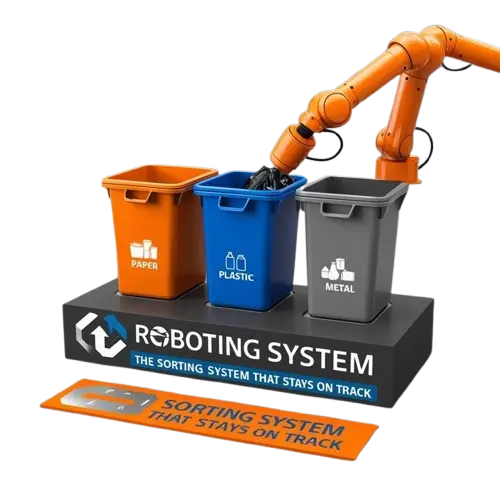

# Automated Robotic Waste Sorting System (ARWSS) 
<p align="center">
  
</p>


## Table of Contents
1. [Installation Guide](#1-installation-guide)
2. [Activate the Environment](#2-activate-the-environment)
3. [Start the Front-end](#3-start-the-front-end)
4. [Start the Back-end](#4-start-the-back-end)
5. [Start the Simulation](#5-start-the-simulation)
6. Troubleshooting
7. [Frequently Asked Questions (FAQ)](#7-frequently-asked-questions-faq)
8. License

## 1. Installation Guide

### Prerequisites
- Python 3.x
- Node.js and npm
- CoppeliaSim (Version 4.7.0 or higher)

### 1.1 Clone the Repository
```sh
git clone https://github.com/Cellie0320/ARWSS
cd ARWSS
```

### 1.2 Install Python and Virtual Environment
1. Download and install Python from [python.org](https://www.python.org/downloads/).
2. Create a virtual environment in the project directory:
    ```sh
    python -m venv .venv
    ```
3. Activate the virtual environment:
    - On Windows:
        ```sh
        .venv\Scripts\activate
        ```
    - On macOS/Linux:
        ```sh
        source .venv/bin/activate
        ```
4. Install the required Python packages:
    ```sh
    pip install -r requirements.txt
    ```

### 1.3 Install Node.js and React
1. Install fnm (Fast Node Manager):
    ```sh
    winget install Schniz.fnm
    ```
2. Configure fnm environment:
    ```sh
    fnm env --use-on-cd | Out-String | Invoke-Expression
    ```
3. Download and install Node.js:
    ```sh
    fnm use --install-if-missing 22
    ```
4. Verify the Node.js version:
    ```sh
    node -v # should print `v22.0.0`
    ```
5. Verify the npm version:
    ```sh
    npm -v # should print `10.1.0`
    ```
6. Navigate to the `src/frontend` directory:
    ```sh
    cd src/frontend
    ```
7. Install React and React DOM:
    ```sh
    npm install react react-dom
    ```
8. Install the Node.js dependencies:
    ```sh
    npm install
    ```
9. Start the React application:
    ```sh
    npm start
    ```

### 1.4 Install CoppeliaSim
1. Download and install CoppeliaSim EDU from [coppeliarobotics.com](https://www.coppeliarobotics.com/downloads).
2. Copy the Lua scripts to the `lua` folder in your CoppeliaSim installation directory. The Lua scripts are located in the [Lua folder directory](./PRJ371-Main-main/ARWSS/Lua).
    ```
    - Open CoppeliaSim
        - File → Open Scene
        - Navigate to the `ARWSS` directory and open the file `Group 5 simulation.ttt` in CoppeliaSim:
            - File → Open Scene
            - Select `Group 5 simulation.ttt`
3. Click the Start Simulation button or press `Ctrl+P`.

### 1.5 Connecting the Simulation to the Backend
1. Ensure the Flask server is running:
    ```sh
    python main.py
    ```
2. Use the `socket.http` module in Lua to make HTTP requests to the backend. Example in `main.lua`:
    ```lua
    local http = require("socket.http")
    local ltn12 = require("ltn12")
    ```

### 1.6 Additional Configuration
- Refer to the [user manual](./PRJ371-Main-main/ARWSS/docs/user_manual/user_manual.md) for detailed operating instructions.

## 2. Activate the Environment
```sh
venv\Scripts\activate
```

## 3. Start the Front-end
In the frontend directory, you can run:
```sh
npm start
```

## 4. Start the Back-end
In the backend directory, you can run:
```sh
python main.py
```

## 5. Start the Simulation
In CoppeliaSim, press the "Start Simulation" button located in the top toolbar to activate the simulation environment.

## 6. Troubleshooting

### Common Issues

#### Environment activation issues:
- Ensure you are using the correct command for your operating system.
- Verify that the virtual environment was created successfully.

#### Front-end not starting:
- Ensure all dependencies are installed by running `npm install`.
- Check for any errors in the terminal and resolve them.

#### Backend not starting:
- Ensure all dependencies are installed by running `pip install -r requirements.txt`.
- Check if the required environment variables are set correctly in the `.env` file.

#### Simulation not starting:
- Ensure CoppeliaSim is installed and the Lua scripts are correctly placed.
- Verify that the simulation file is correctly loaded in CoppeliaSim.

## 7. Frequently Asked Questions (FAQ)

#### How do I change the default port for the backend server?
You can change the port by modifying the `main.py` file to use a different port number.

#### How do I add new API endpoints?
Define the new endpoint in `main.py` and add the corresponding logic.

#### How do I update dependencies?
- For Python dependencies, update the `requirements.txt` file and run `pip install -r requirements.txt` again.
- For Node.js dependencies, use `npm install <package-name>` to add new dependencies and update the `package.json` file.

#### How do I deploy the frontend to a production server?
Run `npm run build` to create a production build and deploy the contents of the `build` folder to your server.

#### How do I connect the simulation to the backend?
Ensure the Flask server is running and use the `socket.http` module in Lua to make HTTP requests to the backend.

## 8. License
License information found about the project in the link below:
https://github.com/Cellie0320/ARWSS/blob/3d68754e8e2396d7d5aaa947e9e83052917ec3f0/LICENSE